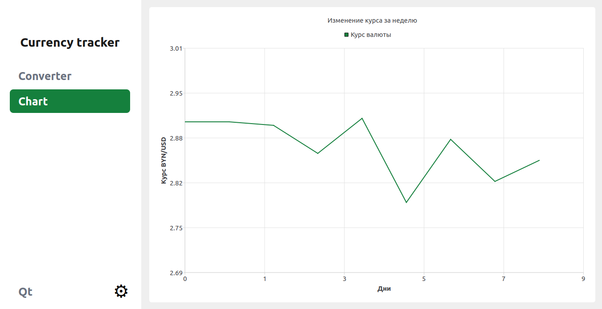

# Currency Tracker (Qt/C++)

Двухстраничное приложение для отслеживания курса валют с графиком и историей.



## Возможности

- Конвертация валют в реальном времени (API НБРБ)
- График изменения курса USD →  BYN
- Сохранение истории курсов в SQLite
- Автоматическое сохранение каждой конвертации

---

## Стек технологий

| Компонент | Используется |
| :--- | :--- |
| **Язык** | C++ (Qt 5/6) |
| **UI** | Qt Widgets, QChart |
| **Сеть** | QNetworkAccessManager |
| **База данных** | SQLite (QSql) |
| **Сборка** | CMake |

---

## Сборка и запуск

### Требования
- Qt 5.15 или выше
- CMake 3.10+

### Сборка и запуск

```bash
mkdir build && cd build
cmake ..
make
./currency-tracker-qt
